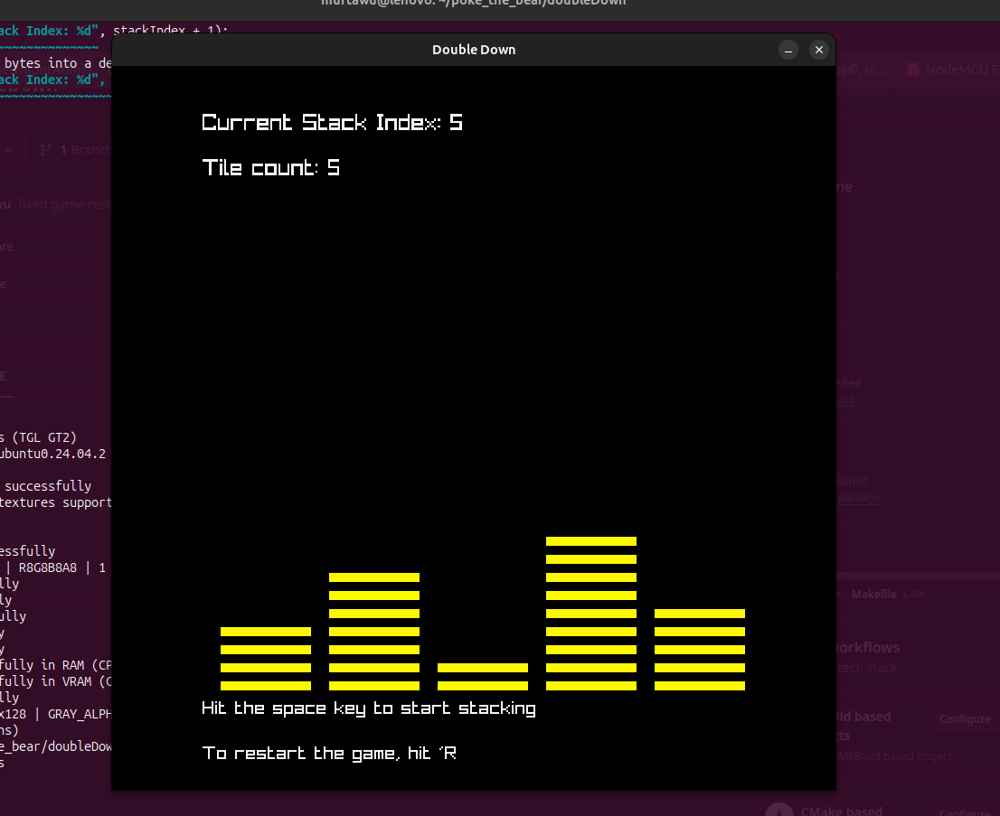

## Double Down 
- Custom C game in raylib

## How to play
- Game designed to test fast eye information capture (number flash)
- Game starts with a brief description of game (five numbers flash for half a second)
- You are to memorize these numbers and use the space and enter key to build 5 stacks. 
    - each stack will contain 'n' bars corresponding to each the five numbers
    
    - Keys
        - Space key = add bar to build your stack for each number in the sequence
        - Enter key = complete a stack and moves to the next stack

    - Example:
        - Say the sequence is {1, 3, 3, 5, 2} when the game interface starts
        - For stack 1 (sequence item 1, 1) => 1 'Space Key' press, then press 'Enter Key'
        - For stack 2 (sequence item 2, 3) => 3 'Space Key' press, then press 'Enter Key'
        - For stack 3 (sequence item 3, 3) => 3 'Space Key' press, then press 'Enter Key'
        - For stack 4 (sequence item 4, 5) => 5 'Space Key' press, then press 'Enter Key'
        - For stack 5 (sequence item 4, 2) => 2 'Space Key' press, then press 'Enter Key'

    - When done press 'Enter' to see how many numbers you correctly captured :)

## Demo [img]
- 

